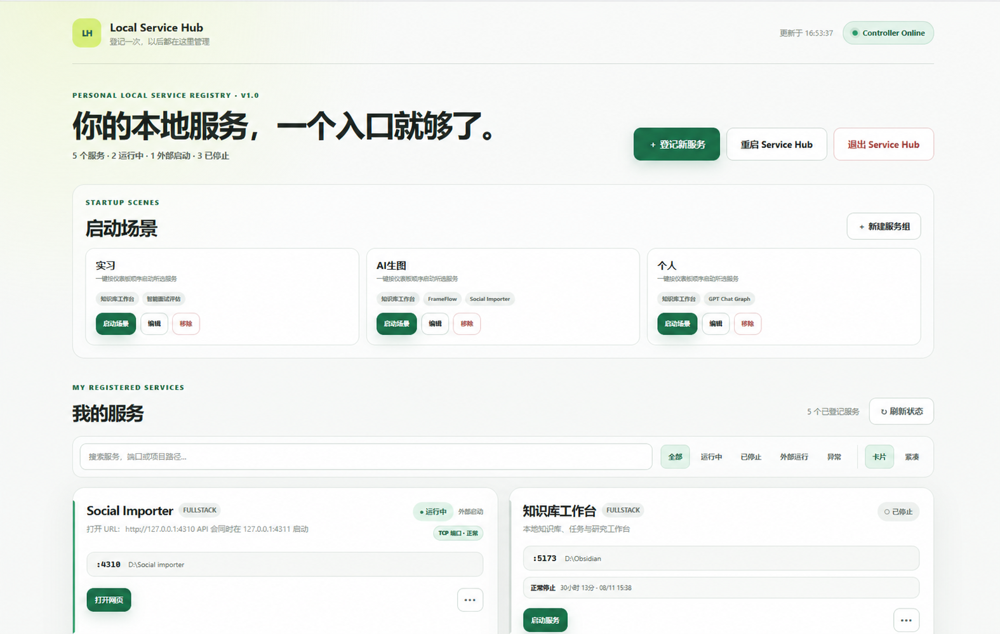
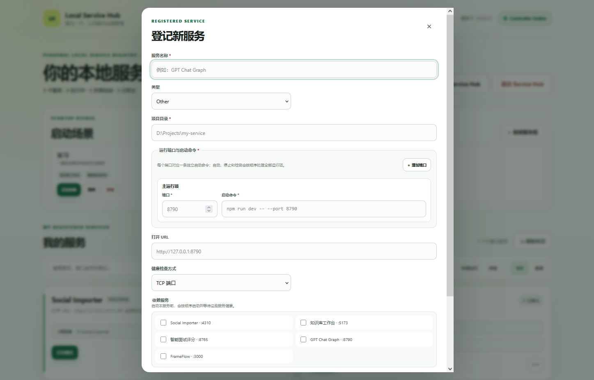

# Local Service Hub V1.0

Local Service Hub 是面向 Windows 的个人本地服务登记与控制中心。它只展示用户主动登记的服务，并通过 Process Compose 提供启动、停止、重启、状态检测和日志查看能力。

- Service Hub：`http://127.0.0.1:8750`
- Process Compose REST API：`http://127.0.0.1:8751`

## 界面预览

### 服务总览与启动场景



### 登记新服务



## 代码与本地数据

公开仓库只包含代码和虚构示例。下列文件保存当前电脑上的真实服务信息，已被 Git 忽略：

| 本地文件 | 用途 |
| --- | --- |
| `services.json` | 服务目录、命令、端口和依赖 |
| `service-groups.json` | 个人服务分组 |
| `process-compose.generated.yaml` | 根据服务配置自动生成的运行配置 |
| `service-inventory.yaml`、`service-registry.yaml` | 可选的本机清单或旧版迁移资料 |
| `.env`、`runtime/`、`logs/` | 环境设置、token、运行状态和日志 |

`services.example.json` 和 `service-groups.example.json` 是可以提交的脱敏示例。首次运行时若真实配置不存在，Service Hub 会创建空配置；也可以复制示例后再编辑：

```powershell
Copy-Item .\services.example.json .\services.json
Copy-Item .\service-groups.example.json .\service-groups.json
```

升级或执行 `git pull` 不会覆盖这些本地数据。迁移电脑时可以单独复制真实配置，但不要复制旧 token。

## 前置要求

- Windows 10/11
- Python 3.11 或更高版本；`setup.ps1` 会自动查找 `py` 或 `python`
- 仅当登记的服务需要 Node.js 时才需另外安装 Node.js

## 安装

安装或校验 Process Compose v1.120.0：

```powershell
powershell -ExecutionPolicy Bypass -File .\scripts\install-process-compose.ps1
```

创建 Python 虚拟环境、安装依赖并生成本地 API token：

```powershell
powershell -ExecutionPolicy Bypass -File .\scripts\setup.ps1 -Dev
```

如需指定 Python，可以使用：

```powershell
powershell -ExecutionPolicy Bypass -File .\scripts\setup.ps1 -Python "C:\Path\To\python.exe" -Dev
```

token 保存在被 Git 忽略的 `runtime\process-compose.token` 中。浏览器不会读取该 token，也不会直接调用 Process Compose API。

## 启动与停止

```powershell
# 前台启动；业务服务默认按需启动
powershell -ExecutionPolicy Bypass -File .\scripts\start.ps1

# 安装或更新桌面快捷方式
powershell -ExecutionPolicy Bypass -File .\scripts\install-desktop-shortcut.ps1

# 可选：安装当前 Windows 用户登录后的隐藏常驻任务
powershell -ExecutionPolicy Bypass -File .\scripts\install-startup-task.ps1

# 停止业务服务、Service Hub 与控制器
powershell -ExecutionPolicy Bypass -File .\scripts\stop.ps1

# 删除桌面快捷方式
powershell -ExecutionPolicy Bypass -File .\scripts\install-desktop-shortcut.ps1 -Remove
```

桌面快捷方式会先检查 `/health`，Service Hub 离线时再调用 `start.ps1`。启动失败或等待超过 60 秒时会显示提示，详细信息保存在本地 `logs\desktop-launcher.log`。

## 工作方式与安全边界

`services.json` 是业务配置源。启动以及网页中的新增、编辑、删除操作都会重新生成 `process-compose.generated.yaml`：

```text
services.json → Service Hub → process-compose.generated.yaml → Process Compose
```

- 两个控制端口均只监听 `127.0.0.1`。
- 浏览器只能提交服务字段和 Service ID，没有任意 Shell 或任意 PID Kill API。
- “纳入管理”会显示目标 PID、进程和命令，确认后才停止该进程。
- 外部启动的服务默认不能由本工具停止或重启。
- 配置文件使用临时文件、备份和原子替换；损坏时提供显式恢复。
- 真实服务路径、命令、分组、日志和 token 不属于公开仓库内容。

## 验证

```powershell
# 生成本机运行配置
.\service-hub\.venv\Scripts\python.exe .\service-hub\generate_config.py

# 校验 Process Compose 配置
.\tools\process-compose\process-compose.exe -f .\process-compose.yaml -f .\process-compose.generated.yaml --dry-run

# 后端测试
.\service-hub\.venv\Scripts\python.exe -m pytest -q
```

当前正式产品文档和发布说明位于 `docs\v1.0\`。
